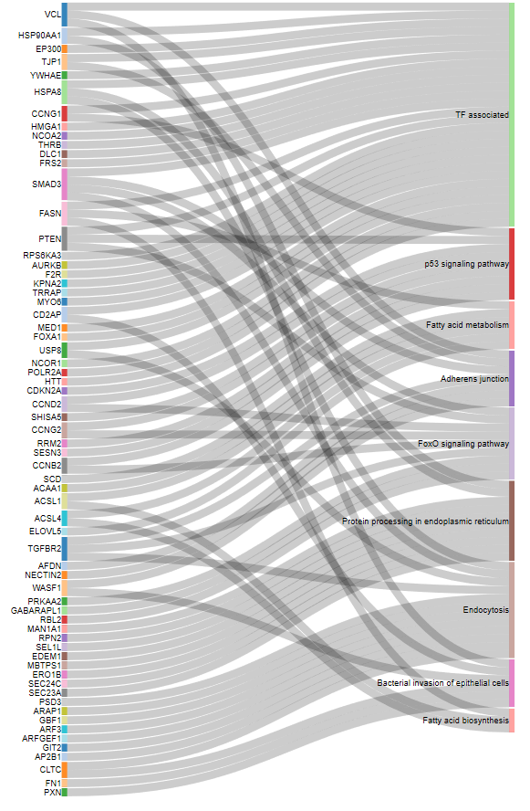

\tableofcontents

\beginsupplement

# 1. Supplementary Figures 

{#figs1}

```{r, include=FALSE, message=FALSE, warning=FALSE}

library(tidygraph)
library(dplyr)
library(tidyr)
library(stringr)
knitr::opts_chunk$set(tidy.opts=list(width.cutoff=50),tidy=TRUE)
#knitr::opts_chunk$set(fig.pos = 'H')
knitr::opts_chunk$set(cache=FALSE)

```

```{r, message=FALSE, warning=FALSE}
library(ceRNAnetsim)
```

## 1.1 *minsamp* dataset analysis in absence of interaction factors.

```{r}
data("minsamp")
```


```{r, message=FALSE, warning=FALSE, fig.cap= "Minimal Dataset in Steady-state", fig.width=5, fig.height=4}
priming_graph(minsamp, competing_count = Competing_expression, miRNA_count = miRNA_expression)%>%
  vis_graph(Competing_color = "navajowhite3", mirna_color = "ivory4",
            title = " ")
```


```{r, message=FALSE, warning=FALSE, fig.keep='all', fig.cap= "Gene2 Upregulation on Minimal Dataset", fig.width=5, fig.height=4}
priming_graph(minsamp, competing_count = Competing_expression, miRNA_count = miRNA_expression)%>%
  update_how("Gene2", 2)%>%
  vis_graph(Competing_color = "navajowhite3", mirna_color = "ivory4", Upregulation = "red", 
            title = " ")
```

```{r, message=FALSE, warning=FALSE, out.width='50%', fig.asp=1, fig.ncol = 2,  fig.show='hold', fig.cap = "Sequential iteration of minsamp data. A) First response of system to Gene2 upregulation (2nd iteration). B) Spreading of perturbation on system (3th iteration)", fig.subcap= NULL}

priming_graph(minsamp, 
              competing_count = Competing_expression, 
              miRNA_count = miRNA_expression) %>%
  update_how("Gene2", 2) %>%
  simulate(cycle=1) %>%
  vis_graph(Competing_color = "navajowhite3", 
            mirna_color = "ivory4", 
            Upregulation = "red", 
            Downregulation = "blue", 
            title = "A")

priming_graph(minsamp, 
              competing_count = Competing_expression, 
              miRNA_count = miRNA_expression)%>%
  update_how("Gene2", 2)%>%
  simulate(2)%>%
  vis_graph(Competing_color = "navajowhite3", 
            mirna_color = "ivory4", 
            Upregulation = "red", 
            Downregulation = "blue", 
            title = "B")

```

## 1.2 *minsamp* dataset analysis with interaction factors.

```{r, message=FALSE, warning=FALSE, fig.cap= "Minimal Dataset with interaction factors in Steady-state", fig.width=5, fig.height=4}
priming_graph(minsamp, competing_count = Competing_expression, miRNA_count = miRNA_expression, aff_factor = c(energy, seed_type), deg_factor = region)%>%
  vis_graph(Competing_color = "navajowhite3", mirna_color = "ivory4", 
            title = " ")

```

```{r, message=FALSE, warning=FALSE, fig.cap= " When Gene2 is upregulated on Minimal Dataset with interaction factors", fig.width=5, fig.height=4}
priming_graph(minsamp, competing_count = Competing_expression, miRNA_count = miRNA_expression, aff_factor = c(energy, seed_type), deg_factor = region)%>%
  update_how("Gene2", 2)%>%
  vis_graph(Competing_color = "navajowhite3", mirna_color = "ivory4", Upregulation = "red", 
            title = " ")
```

```{r, message=FALSE, warning=FALSE, out.width='50%', fig.asp=1, fig.ncol = 2, fig.show='hold', fig.cap = "Sequential iteration of minsamp data with interaction factors A)First response of system to Gene2 upregulation (2nd iteration). B)Spreading of perturbation on system (3th iteration)"}
priming_graph(minsamp, competing_count = Competing_expression, miRNA_count = miRNA_expression, aff_factor = c(energy, seed_type), deg_factor = region)%>%
  update_how("Gene2", 2)%>%
  simulate(cycle = 1)%>%
  vis_graph(Competing_color = "navajowhite3", mirna_color = "ivory4", Upregulation = "red", Downregulation = "blue", title = "A")

priming_graph(minsamp, competing_count = Competing_expression, miRNA_count = miRNA_expression, aff_factor = c(energy, seed_type), deg_factor = region)%>%
  update_how("Gene2", 2)%>%
  simulate(cycle = 2)%>%
  vis_graph(Competing_color = "navajowhite3", mirna_color = "ivory4", Upregulation = "red", Downregulation = "blue", title = "B")
  
  
```

## 1.3 Common target perturbation in *minsamp* dataset.

```{r, message=FALSE, warning=FALSE, out.width='50%', fig.asp=1, fig.ncol = 2, fig.show='hold', fig.cap = "Perturbation of Gene4 on minsamp data with interaction factors. A) Network at steady-state. B) Upregulation of Gene4. C) Primary response of network to upregulation of Gene4. D) Re-regulation of whole nodes on system (3th iteration)"}

priming_graph(minsamp, competing_count = Competing_expression, miRNA_count = miRNA_expression, aff_factor = c(energy, seed_type), deg_factor = region)%>%
  vis_graph(Competing_color = "navajowhite3", mirna_color = "ivory4", Upregulation = "red", title = "A")

priming_graph(minsamp, competing_count = Competing_expression, miRNA_count = miRNA_expression, aff_factor = c(energy, seed_type), deg_factor = region)%>%
  update_how("Gene4", 2)%>%
  vis_graph(Competing_color = "navajowhite3", mirna_color = "ivory4", Upregulation = "red", title = "B")

priming_graph(minsamp, competing_count = Competing_expression, miRNA_count = miRNA_expression, aff_factor = c(energy, seed_type), deg_factor = region)%>%
  update_how("Gene4", 2)%>%
  simulate(cycle=1)%>%
  vis_graph(Competing_color = "navajowhite3", mirna_color = "ivory4", Upregulation = "red", title = "C")

priming_graph(minsamp, competing_count = Competing_expression, miRNA_count = miRNA_expression, aff_factor = c(energy, seed_type), deg_factor = region)%>%
  update_how("Gene4", 2)%>%
  simulate(cycle=2)%>%
  vis_graph(Competing_color = "navajowhite3", mirna_color = "ivory4", Upregulation = "red", title = "D")
```


{#figs9}


# 2 Supplementary Tables

```{r, eval=FALSE, include=FALSE}
library(xtable)
knitr::opts_chunk$set(tidy.opts=list(width.cutoff=50),tidy=TRUE)
library(gt)
knitr::opts_chunk$set(cache=FALSE)

```

## 2.1 *minsamp* dataset


|competing| miRNA | Competing_expression | miRNA_expression | seed_type | region | energy
|-----------|------------|----------|----------------|---------|-----------|----------|
| `Gene1`   | `Mir1` | 10000 | 1000 | 0.43 | 0.30 | -20 |
| `Gene2`   | `Mir1` | 10000 | 1000 | 0.43 | 0.01 | -15 |
| `Gene3`   | `Mir1` | 5000  | 1000 | 0.32 | 0.40 | -14 |
| `Gene4`   | `Mir1` | 10000 | 1000 | 0.23 | 0.50 | -10 |
| `Gene4`   | `Mir2` | 10000 | 2000 | 0.35 | 0.90 | -12 |
| `Gene5`   | `Mir2` | 5000  | 2000 | 0.05 | 0.40 | -11 |
| `Gene6`   | `Mir2` | 10000 | 2000 | 0.01 | 0.80 | -25 |

Table: *minsamp* sample dataset that includes interaction factors. The parameters which affect miRNA:target interactions (i.e. seed type, region, energy) are provided in sample dataset.

## 2.2 Significant factors in miRNA:target interactions

Some of information about miRNA:target interactions were exhibited directly by high-throughput studies. On the other hand, we were examined other interacion factors based on different studies.

+ [@helwak_mapping_2013; @moore_mirnatarget_2015] reported the energy values in miRNA:target interactions.
+ Comparisons of canonical seed types were evaluated by study of [@grimson_microrna_2007], while functional and non-functional seed interactions were studied by [@bartel_micrornas:_2009] and [@betel2010comprehensive]. 
+ Numeric definition of target region location effect was performed based on studies of [@hausser_analysis_2013] and [@helwak_mapping_2013]


|seed type | seed type effect 
|----------|---------------|
| 6-mer_noncanonical | 0.05 | 
| 9-mer | 0.43 | 
| 6-mer | 0.07 | 
| 8-mer | 0.43 | 
| 7-mer | 0.23 | 
| none | 0.01 | 
| 5-mer_noncanonical | 0.04 | 
| 5-mer | 0.05 | 
| 6-merA1_noncanonical | 0.05 | 
| 7-mer-8m_noncanonical | 0.21 | 
| 7-mer-8m | 0.25 | 
| 8-mer_noncanonical | 0.35 | 
| 7-merA1_noncanonical | 0.16 | 
| 7-merA1 | 0.19 | 
| 6-merA1 | 0.07 | 

Table: Efficiency factors for seed types.


| region | region effect
|---------|-------------|
| 3UTR | 0.84 |
| CDS | 0.42 | 
| 3UTRCDS | 0.93 | 
| 5UTR | 0.01 |
| 5UTRCDS | 0.42 | 
| none  | 0.01 | 
| intron | 0.01 | 
| CDS3UTR | 0.93 | 
| CDS5UTR | 0.42 | 
| exon_unclassified | 0.20 | 
| CDS3UTRintron | 0.93 | 
| 3UTRintron | 0.84 | 
| CDSintron | 0.42 | 
| 5UTRintron | 0.01 | 
| 5UTR3UTR | 0.93 | 
| CDS5UTR3UTR | 0.93 |

Table: Efficiency factors for binding regions on targets


## 2.3 Content of High-throughput experimental studies 

|  Variable | Structure | Means 
|-----------|-----------|-------|
|  cluster    | character | Barcode from experimentally method |
|  chromosome    | character | Chromosome of Target gene from raw data |
|   start_position    | numeric | Gene start position from raw data |
|   end_position     | numeric | Gene end position from raw data |
|   strand     | character | Gene strand |
|   hgnc_symbol     | character | Gene name (Symbol) |
|   Ensembl_Gene_Id     | character | Ensembl Gene Id of gene |
|   Ensembl_Transcript_Id   | character | Ensembl transcript id of mRNA of Target gene |
|   target_seq   | character | mRNA sequences targeted by miRNA |
|   miRNA   | character | miRNA id (from miRBase version 21 ) |
|   miR_seq   | character | miRNA sequence |
|   seed_type   | character | seed type of miRNA:target interaction |
|   Energy   | numeric | Energy of miRNA:target binding |
|   HG38build_loc   | character | Recent chromosomal location of Gene |
|   Genome_build   | character| Genome build of given chromosome, start and end positions |
|   region   | character | interaction location on target | 
|   region_effect   | numeric | Coefficient of location on target | 
|   seed_type_effect   | numeric | Coefficient for seed sequence of miRNA:target interaction |

Table: miRNA:target pairs supported by High-throughput Experiments


## 2.4  Variables of network object during simulation

As a result of simulation a dataset, a graph object is obtained that includes various variables in edge and node data. A graph object includes variables at following.

 \begin{table}[ht]
\centering
\caption{ The context graph object during the process.}
\begin{tabularx}{\textwidth}{llX}
  \hline
 Variables & Structure & Means \\
  \hline
   \emph{Node Variables} & & \\
   name    & character & node name \\
   type    & character &Competing or miRNA \\
   node\_id    & numeric & in on graph object \\
   initial\_count     & numeric & Initial Expression value of node \\
   count\_pre     & numeric & Expression value of node at previous regulation \\
   count\_current     & numeric & Existing expression value of node \\
   changes\_variable     & character & Regulation of node (Up, down or steady) \\
   \hline
   \emph{Edge Variables} & & \\
   Competing name   & character & name of genes\\
   miRNA name   & character & name of miRNAs \\
   Competing expression   & numeric & Expression values of competing elements at steady-state \\
   miRNA expression   & numeric & Expression values of miRNA elements at steady-state \\
   energy   & numeric & coefficient of miRNA:target interactions (binding affinity) \\
   seed type   & numeric & coefficient of miRNA:target interactions (binding affinity) \\
   region   & numeric & coefficient of miRNA:target interactions (degradation efficiency) \\
   afff factor   & numeric& coefficient scaled and combined affinity factor \\
   degg factor   & numeric &coefficient scaled and combined degradation factor \\ 
   comp\_count\_list   & list & list of competing expression for each iteration \\ 
   comp\_count   & numeric & pre: competing expression at previous iteration; current: competing expression at present iteration \\
   mirna\_count\_list   & list & list of miRNA expression for each iteration \\
   mirna\_count   & numeric & pre: miRNA expression at previous iteration; current: miRNA expression at present iteration \\
   effect   & numeric & pre: total miRNA reppressive effect on individual target at previous iteration ; current: miRNA reppressive effect on individual   target at present iteration \\
   effect\_list   & list & list of miRNA reppressive effect on individual target for each iteration \\
  \hline
\end{tabularx}
\end{table}


\newpage


# REFERENCES
