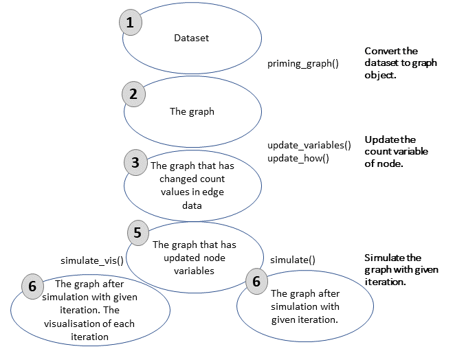

\beginsupplement

# 1. Defined functions for ceRNA models and workflow of method
We defined the functions that can be used with R programming. Briefly, these functions process a given miRNA:gene dataset and convert to graph object. All values that are significant in miRNA:target interactions are stored in edge variables and processed with formulations that are given in previous section. The functions and steps of approach are explained as following (Figure S1) :


**Convertion of dataset**: priming_graph function processes the given dataset that includes competing elements in first variable and repressive element in second variable. If the affinity and/or degradation factors are specified in the function, factors are taken into account, are processed with defaults in vice versa. The formulations that are given in equations (1-4) are performed in this function. This step gives the graph object which contains efficiency values of miRNA:competing target pairs in steady-state in terms of amount. It is assumed that the initial target amounts in the dataset is observed after the reppressive activity of miRNAs in steady-state. 


{#fig1}


**Transition of variables in graph**: In the previous step, the calculations are performed in the edge variables of the graph object. However, the graph object allows to use node variables, while the node features are handled to the graph. In this direction, update_nodes function carries the amount values to node variables This step must be applied with “once” option because it is primary process.


**Trigger change in graph**: The dataset are assumed as steady-state in previous step and the efficieny coefficients are calculated according to this acceptance. In the network that is found in steady-state conditions, the change is applied to the graph object for disturbtion of steady-state. To provide the disturbtion in the network the workflow offer two methods: update_variables and update_how. The first, a new dataset that is contained competing and repressive element names and current values of these can be processed with update_variables. The second option, the amount of the given node name in update_how function can be changed according to “how” argument.


**Updating current values of variables**: After variables updating in edge varibles, these are carried to node variables. Current and previous values of variables are stored as node variables with update_variables function.


**Simulation of competing behavior of targets**: After the change in the steady-state conditions, the network elements try to gain steady-state again. This process progresses as repeating of regulations after the spreading the changes in the network. In this step, simulation of regulations according to given cycle count in simulate function is applied. After each simulation cycle, the miRNA repression values are re-calculated and the current values of competing elements are found and saved. The process is performed in the edge data and at the same time outputs of the calculations are carried from edge to node data.


The node elements in the dataset are handled as two type; repressives (miRNAs) and competings (targets). It is assumed in approach that while targets are degrading or inhibiting by miRNAs continuously, miRNAs reversibly used. If the trigger of the network is a miRNA, it maintains the current value of amount that provides by user. On the contrary, it tries to help this process to provide steady-state through the regulations on its amount, if a competing element is used as a trigger. The functions that are used in the approach are developed with R programming so as can be used with other packages. These are can be found in the github repository [ceRNAnetsim github page](https://github.com/selcenari/ceRNAnetsim) and improved with contributions of others.


```{r, include=FALSE, message=FALSE, warning=FALSE}

library(tidygraph)
library(dplyr)
library(tidyr)
library(stringr)

```


```{r, message=FALSE, warning=FALSE}
#install.packages("devtools")
#devtools::install_github("selcenari/ceRNAnetsim")
library(ceRNAnetsim)
```

+ load *minsamp* data

```{r}
data("minsamp")

minsamp
```

See Figure S1 in Supplementary Tables file.

## *minsamp* dataset analysis in lack of interaction factors.

Firstly, we have analysed minimal data without interaction factors between miRNA:target.

- 1. We have evaluated graph in the steady state conditions as followings:

```{r, message=FALSE, warning=FALSE, fig.cap= "Minimal Dataset in Steady-state", fig.width=5, fig.height=4}
priming_graph(minsamp, competing_count = Competing_expression, miRNA_count = miRNA_expression)%>%
  vis_graph(Competing_color = "navajowhite3", mirna_color = "ivory4", title = "Minimal dataset in steady-state conditions")
```

- 2. We have obtained graph after change on Gene2 expression as followings:

```{r, message=FALSE, warning=FALSE, fig.keep='all', fig.cap= "Gene2 Upregulation on Minimal Dataset", fig.width=5, fig.height=4}
priming_graph(minsamp, competing_count = Competing_expression, miRNA_count = miRNA_expression)%>%
  update_how("Gene2", 2)%>%
  vis_graph(Competing_color = "navajowhite3", mirna_color = "ivory4", Upregulation = "red", title = "Gene2 Upregulation without interaction factors")
```


- 3. We have determined regulations after Gene2 Upregulation:

```{r, message=FALSE, warning=FALSE, out.width='50%', fig.asp=1, fig.ncol = 2, fig.cap = "Sequential iteration of minsampdata", fig.subcap= c("First response of system to Gene2 upregulation (2nd iteration)", "Spreading of perturbation on system (3th iteration)")}

priming_graph(minsamp, competing_count = Competing_expression, miRNA_count = miRNA_expression)%>%
  update_how("Gene2", 2)%>%
  simulate_vis(Competing_color = "navajowhite3", mirna_color = "ivory4", Upregulation = "red", Downregulation = "blue", title = "Regulations after Gene2 Upregulation", 2)

```


Note that the regulations are colored according to expression changes of present and a previous value. So, it can be observed that whole gene expressions increase in comparison of initial steady-state. The overall regulations of gene expressions are as followings:

```{r, message=FALSE, warning=FALSE}
priming_graph(minsamp, competing_count = Competing_expression, miRNA_count = miRNA_expression)%>%
  update_how("Gene2", 2)%>%
  simulate(2)%>%
  activate(edges)%>%
  as_tibble()%>%
  select(Competing_name,comp_count_list,effect_list)%>%
  unnest()
```

## *minsamp* dataset analysis with interaction factors.

We have made the same analysis in present of interaction factors.

```{r, message=FALSE, warning=FALSE, fig.cap= "Minimal Dataset with interaction factors in Steady-state", fig.width=5, fig.height=4}
priming_graph(minsamp, competing_count = Competing_expression, miRNA_count = miRNA_expression, aff_factor = c(energy, seed_type), deg_factor = region)%>%
  vis_graph(Competing_color = "navajowhite3", mirna_color = "ivory4", title = "Minimal dataset with interaction factors in steady-state conditions")

```

```{r, message=FALSE, warning=FALSE, fig.cap= " When Gene2 is upregulated on Minimal Dataset with interaction factors", fig.width=5, fig.height=4}
priming_graph(minsamp, competing_count = Competing_expression, miRNA_count = miRNA_expression, aff_factor = c(energy, seed_type), deg_factor = region)%>%
  update_how("Gene2", 2)%>%
  vis_graph(Competing_color = "navajowhite3", mirna_color = "ivory4", Upregulation = "red", title = "Gene2 Upregulation with interaction factors")
```

```{r, message=FALSE, warning=FALSE, out.width='50%', fig.asp=1, fig.ncol = 2, fig.cap = "Sequential iteration of minsampdata with interaction factors", fig.subcap= c("First response of system to Gene2 upregulation (2nd iteration)", "Spreading of perturbation on system (3th iteration)")}
priming_graph(minsamp, competing_count = Competing_expression, miRNA_count = miRNA_expression, aff_factor = c(energy, seed_type), deg_factor = region)%>%
  update_how("Gene2", 2)%>%
  simulate_vis(Competing_color = "navajowhite3", mirna_color = "ivory4", Upregulation = "red", title = "Gene2 Upregulation with interaction factors",2)
```


When the graphs which were resulted from analyses were examined, it was observed that behaviours were same. But, when the results were analysed in terms of expression values, the regulation differences can be observed.

```{r, message=FALSE, warning=FALSE}
priming_graph(minsamp, competing_count = Competing_expression, miRNA_count = miRNA_expression, aff_factor = c(energy, seed_type), deg_factor = region)%>%
  update_how("Gene2", 2)%>%
  simulate(3)%>%
  activate(edges)%>%
  as_tibble()%>%
  select(Competing_name,comp_count_list,effect_list)%>%
  unnest()
```

## Common target perturbation in *minsamp* dataset.

There are hundreds of defined miRNAs for human, so this results in presence of common targets of miRNAs in cells. Therefore, we have analysed perturbation efficiency of common target in *minsamp* dataset.

```{r, message=FALSE, warning=FALSE, out.width='50%', fig.asp=1, fig.ncol = 2, fig.cap = "Perturbation of Gene4 on minsampdata with interaction factors", fig.subcap= c("1st iteration after Gene4 upregulation", "2nd iteration after Gene4 perturbation")}
priming_graph(minsamp, competing_count = Competing_expression, miRNA_count = miRNA_expression, aff_factor = c(energy, seed_type), deg_factor = region)%>%
  update_how("Gene4", 2)%>%
  simulate_vis(Competing_color = "navajowhite3", mirna_color = "ivory4", Upregulation = "red", title = "Common Gene-Gene4 Upregulation without interaction factors",2)
```

The common target perturbation  (increasing to two fold at Gene4 expression in presence of interaction factors) resulted in more prominent efficiency at the same conditions (shown in following).

```{r, message=FALSE, warning=FALSE}
priming_graph(minsamp, competing_count = Competing_expression, miRNA_count = miRNA_expression, aff_factor = c(energy, seed_type), deg_factor = region)%>%
  update_how("Gene4", 2)%>%
  simulate(3)%>%
  activate(edges)%>%
  as_tibble()%>%
  select(Competing_name,comp_count_list,effect_list)%>%
  unnest()
```

## Determination of perturbation efficiencies efficiencies of elements in system.

```{r, message=FALSE, warning=FALSE}

priming_graph(minsamp, competing_count = Competing_expression, miRNA_count = miRNA_expression, aff_factor = c(energy, seed_type), deg_factor = region)-> sample_graph

find_node_perturbation(sample_graph, how = 2, cycle = 3, limit = 0.1)

```


# 2. Obtaining breast cancer dataset and integration

This section describes how to apply `ceRNAnetsim` package on a breast cancer patient miRNA:target interaction dataset. Before the approach, we obtained three datasets and combined them.

```{r, echo=FALSE, message= FALSE, warning=FALSE}
# Install the packages which is necessary to obtain and process datasets.
#install.packages("BiocManager")
#BiocManager::install("SummarizedExperiment")
#BiocManager::install("TCGAbiolinks")
library(TCGAbiolinks)
library(SummarizedExperiment)
```

## 2.1 How to get gene expression counts of TCGA-E9-A1N5 patient.

We have obtained the gene expression values of patient using [TCGAbiolinks](https://www.bioconductor.org/packages/release/bioc/html/TCGAbiolinks.html) package from [Bioconductor](https://www.bioconductor.org/). For this process, we have followed the instructions of the package. `TCGAbiolinks` package provides to obtain data for whole number of given barcode(s) at once. But, we preferred to download them seperately to show datasets.

+ Obtain to gene expression counts of tumor tissue.

```{r,message= FALSE, warning=FALSE, eval=FALSE}

BCP_tumor <- GDCquery(project = "TCGA-BRCA",
                  data.category = "Transcriptome Profiling",
                  data.type = "Gene Expression Quantification", 
                  workflow.type = "HTSeq - Counts",
                  barcode = "TCGA-E9-A1N5-01A-11R-A14D-07")

GDCdownload(BCP_tumor)
BCPGE_tumor <- GDCprepare(BCP_tumor)

as.data.frame(assay(BCPGE_tumor))%>%
  mutate(ensembl_gene_id = rownames(.))%>%
  dplyr::inner_join(as.data.frame(rowData(BCPGE_tumor)), by = "ensembl_gene_id")%>%
  dplyr::select(ensembl_gene_id, external_gene_name, 1)-> TCGA_E9_A1N5_tumor

colnames(TCGA_E9_A1N5_tumor)[3] <- "GE_tumor"

head(TCGA_E9_A1N5_tumor)
```

+ Obtain to gene expression counts of normal tissue.

```{r, message= FALSE, warning=FALSE, eval=FALSE}
BCP_normal <- GDCquery(project = "TCGA-BRCA",
                  data.category = "Transcriptome Profiling",
                  data.type = "Gene Expression Quantification", 
                  workflow.type = "HTSeq - Counts",
                  barcode = "TCGA-E9-A1N5-11A-41R-A14D-07")
GDCdownload(BCP_normal)

BCPGE_normal <- GDCprepare(BCP_normal)

as.data.frame(assay(BCPGE_normal))%>%
  mutate(ensembl_gene_id = rownames(.))%>%
  dplyr::inner_join(as.data.frame(rowData(BCPGE_normal)), by = "ensembl_gene_id")%>%
  dplyr::select(ensembl_gene_id, external_gene_name, 1)-> TCGA_E9_A1N5_normal

colnames(TCGA_E9_A1N5_normal)[3] <- "GE_normal"

head(TCGA_E9_A1N5_normal)

```

## 2.2 How to get miRNA expression counts of TCGA-E9-A1N5 patient.

We have used `TCGAbiolinks` package to obtain miRNA expression quantification. The query gives read count of miRNA as isoform chromosome coordination. The data also contains mature miRNA information. So, we processed data to attain -5p -3p isoform information using mirbase release21 dataset.

+ Get the mirbase id of mature miRNA:

We downloaded the mirbase release 21 dataset from [mirbase](http://www.mirbase.org/ftp.shtml) and processed the patient mirna expression datasets as following:

```{r, message= FALSE, warning=FALSE}
library(readr)
read_tsv("hsa_mirna.txt", comment = "#", col_names = FALSE)%>%
  dplyr::select(mirna_type= X3, definition = X9)%>%
  filter(!endsWith(mirna_type, "primary_transcript"))%>%
  tidyr::separate(definition, c("ID", "Alias", "Name", "Derivated"), sep = ";")%>%
  dplyr::select(Alias, Name)%>%
  tidyr::separate(Alias, c("trash1", "ID"), sep = "=")%>%
  tidyr::separate(Name, c("trash2", "Name"), sep = "=")%>%
  dplyr::select(-trash1, -trash2)-> mirbase_id_conv

head(mirbase_id_conv)
```

+ Obtain the miRNA expression of tumor tissue of patient:

```{r, message= FALSE, warning=FALSE, eval=FALSE}
BCP_mirnatumor <- GDCquery(project = "TCGA-BRCA",
                  data.category = "Transcriptome Profiling",
                  data.type = "Isoform Expression Quantification",
                  workflow.type = "BCGSC miRNA Profiling",
                  barcode = "TCGA-E9-A1N5-01A-11R-A14C-13")

GDCdownload(BCP_mirnatumor)

GDCprepare(BCP_mirnatumor)%>%
  as.data.frame()%>%
  dplyr::select(miRNA_ID, read_count, reads_per_million_miRNA_mapped, miRNA_region)%>%
  dplyr::filter(startsWith(miRNA_region, "mature"))%>%
  dplyr::mutate(mirbase_id =str_remove(miRNA_region, "mature,"))%>%
  dplyr::select(-miRNA_region)%>%
  dplyr::inner_join(mirbase_id_conv, by = c("mirbase_id"="ID"))%>%
  dplyr::select(miRNA_name = Name, read_count, reads_per_million_miRNA_mapped)%>%
  dplyr::group_by(miRNA_name)%>%
  mutate(read_count= sum(read_count), reads_per_million_miRNA_mapped = sum(reads_per_million_miRNA_mapped))%>%
  dplyr::ungroup()%>%
  distinct() -> BCPME_mirnatumor

head(BCPME_mirnatumor)
```

+ Obtain the miRNA expression of normal tissue of patient:

```{r, message= FALSE, warning=FALSE, eval=FALSE}
BCP_mirnanormal <- GDCquery(project = "TCGA-BRCA",
                  data.category = "Transcriptome Profiling",
                  data.type = "Isoform Expression Quantification",
                  workflow.type = "BCGSC miRNA Profiling",
                  barcode = "TCGA-E9-A1N5-11A-41R-A14C-13")

GDCdownload(BCP_mirnanormal)
# a616435d-0b69-48ac-813d-5d75ad9b85eb.mirbase21.isoforms.quantification.txt

GDCprepare(BCP_mirnanormal)%>%
  as.data.frame()%>%
  dplyr::select(miRNA_ID, read_count, reads_per_million_miRNA_mapped, miRNA_region)%>%
  dplyr::filter(startsWith(miRNA_region, "mature"))%>%
  dplyr::mutate(mirbase_id =str_remove(miRNA_region, "mature,"))%>%
  dplyr::select(-miRNA_region)%>%
  dplyr::inner_join(mirbase_id_conv, by = c("mirbase_id"="ID"))%>%
  dplyr::select(miRNA_name = Name, read_count, reads_per_million_miRNA_mapped)%>%
  dplyr::group_by(miRNA_name)%>%
  mutate(read_count= sum(read_count), reads_per_million_miRNA_mapped = sum(reads_per_million_miRNA_mapped))%>%
  dplyr::ungroup()%>%
  distinct() -> BCPME_mirnanormal

head(BCPME_mirnanormal)
```


## 2.3 Get the high-throughput experimental miRNA:target dataset.

There are various datasets about miRNA:target pairs such as miRTarBase, DianaTools, miRecords, miRWalk etc. Some of these present the experimentally supported miRNA target pairs or only predicted ones. The experimentally supported datasets generally provides weak evidence for interactions. For these reasons, we obtained the high-throughput experimental miRNA:target dataset from two studies performed by Helwak et al. and Moore et al. These steps were not handle in this file because they contain many processes. 

Briefly these datasets contain various common information about miRNA:target interactions such as the miRNA name, miRNAsequence, target name, target sequence, their chromosomal locations, binding location on the target sequence, binding free energy, seed structure. But these datasets provides the informations with different data structures.So we followed the steps:

+ The datasets were directly downloaded from supplementary data files of the studies.
+ It was provided that the datasets are converted to same human genome build.
+ The seed type information was organized as the same style.
+ The datasets were combined.
+ We commited the interaction factors as numeric values according to previous studies. (We added the interaction factors and their numeric values at Supplementary tables S2-3)

Finally, we have obtained the experimentally supported miRNA:target dataset. 

```{r, message= FALSE, warning=FALSE}
data("experimentalmirnagene")

head(experimentalmirnagene)

```

The methods about miRNA:target interactions are based a basic principle that is reading after isolation of miRNA:target chimerics. The datasets contain all the chimeric miRNA:target structures found in the medium during the experiment. On the other hand, it could be said that the reading is performed as snapshot.Because of that, the methods can provide different chimeric interactions the same miRNA:target pair. We have preferred to select most effective interaction parameters for the same miRNA:target pairs that can exhibit various interactions. The step is performed as: 

```{r, message= FALSE, warning=FALSE, eval=FALSE}
experimentalmirnagene%>%
  dplyr::select(miRNA, Ensembl_Gene_Id, hgnc_symbol, Energy, seed_type_effect, region_effect)%>%
  distinct()%>%
  group_by(Ensembl_Gene_Id, miRNA)%>%
  mutate(seed_type_effect= ifelse(seed_type_effect==max(seed_type_effect), seed_type_effect, max(seed_type_effect)), Energy = ifelse(Energy==min(Energy), Energy, min(Energy)), region_effect= ifelse(region_effect==max(region_effect), region_effect, max(region_effect)))%>%
  distinct()-> tocombine_mirnagene

head(tocombine_mirnagene)
```

## 2.4 Combine the dataset

```{r, message= FALSE, warning=FALSE, eval=FALSE}
BCPME_mirnanormal%>%
  dplyr::inner_join(tocombine_mirnagene, by = c("miRNA_name"="miRNA"))%>%
  dplyr::inner_join(TCGA_E9_A1N5_normal, by = c("Ensembl_Gene_Id"="ensembl_gene_id", "hgnc_symbol"="external_gene_name"))%>%
  distinct()%>%
  dplyr::select(hgnc_symbol, miRNA_name, mirna_RPM= reads_per_million_miRNA_mapped, GE_normal, Energy, seed_type_effect, region_effect)-> E9GE_mirnagenenormal

```


```{r}
data("E9GE_mirnagenenormal")
head(E9GE_mirnagenenormal)
```

```{r, message= FALSE, warning=FALSE, eval=FALSE}
BCPME_mirnatumor%>%
  dplyr::inner_join(tocombine_mirnagene, by = c("miRNA_name"="miRNA"))%>%
  dplyr::inner_join(TCGA_E9_A1N5_tumor, by = c("Ensembl_Gene_Id"="ensembl_gene_id", "hgnc_symbol"="external_gene_name"))%>%
  distinct()%>%
  dplyr::select(hgnc_symbol, miRNA_name, mirna_RPM= reads_per_million_miRNA_mapped, GE_tumor, Energy, seed_type_effect, region_effect)-> E9GE_mirnagenetumor

```

```{r}
data("E9GE_mirnagenetumor")
head(E9GE_mirnagenetumor)
```

## 2.5 Selection of trigger node

We have compared two datasets that are obtained for the tumor and normal tissue samples of same patient. We tried to change expression of a gene in normal tissue as the same level in the tumor tissue. 

For this step, we have determined the changes of the gene expression in terms of fold change:

```{r}
E9GE_mirnagenetumor%>%
  dplyr::select(hgnc_symbol, GE_tumor)%>%
  dplyr::inner_join((E9GE_mirnagenenormal%>%dplyr::select(hgnc_symbol, GE_normal)), by ="hgnc_symbol")%>%
  dplyr::mutate(FC= GE_tumor/GE_normal)%>%
  distinct()%>%
  filter(FC>2.5,  FC<3.5)-> three_fold_change

# ABCC1 gene has 5827 read count in tumor tissue although 1420 in normal tissue (FC=4.10)
```
Secondly, we have determined the most important nodes of network. We applied `find_node_perturbation` function. We only defined nodes that affect the other nodes more than 1.05 fold change with 10 iteration when they increase 3 fold. 

```{r, include=FALSE, eval=FALSE}
as.data.frame(E9GE_mirnagenenormal)%>%
  priming_graph(competing_count = GE_normal, miRNA_count = mirna_RPM, aff_factor = c(Energy, seed_type_effect), deg_factor = region_effect)%>%
  find_node_perturbation(how = 3, cycle = 10, fast = 5)%>%
  filter(!is.na(perturbation_efficiency))->perturbationofnetwork

perturbationofnetwork
```
This dataset, perturbationofnetwork, includes 382 genes of totally 423 nodes.

Result of this, we obtained common nodes of these two datasets (i.e perturbationofnetwork and three_fold_change) and selected a gene, SERPINE2.

```{r, eval=FALSE}
three_fold_change%>%
  inner_join(perturbationofnetwork, by = c("hgnc_symbol"="name"))

#Selected node is SERPINE2
```
## 2.5 Approach of Method into Combined Datasets

We selected SERPINE2 gene for simulation of regulation on network.

### 2.5.1 Find iteration of simulation

```{r, fig.cap= "Percentage of affected nodes of each iteration for SERPINE2 Gene"}
as.data.frame(E9GE_mirnagenenormal)%>%
 priming_graph(competing_count = GE_normal, miRNA_count = mirna_RPM, aff_factor = c(Energy, seed_type_effect), deg_factor = region_effect)%>%
 update_how("SERPINE2",2.75) %>%
 simulate(150) %>%
 find_iteration(limit=1, plot= TRUE) #limit=1 describes the change that is not taken into account.
```

The node amount of changed gene on the system in terms of percentage were shown in above. As seen, firstly, the changed gene count increase. The system which contains the hundreds of miRNAs and thousands of genes can slowly gain the steady-state again. At first glance, it can be assumed that when all nodes in the system are reached, stable state will be provided. However, although all nodes are reached, the nodes competing with each other cause the edits to continue for a while.

The dynamics of the approach are shown in package viggnettes [link](https://selcenari.github.io/ceRNAnetsim/articles/convenient_iteration.html). 

So, we offered an approach about to find iteration. `find_iteration` function does not give the iteration to gain steady-state, but it gives the iteration which has maximum affected node counts. The function is applied as following:

```{r}
as.data.frame(E9GE_mirnagenenormal)%>%
 priming_graph(competing_count = GE_normal, miRNA_count = mirna_RPM, aff_factor = c(Energy, seed_type_effect), deg_factor = region_effect)%>%
 update_how("SERPINE2",2.75) %>%
 simulate(100) %>%
 find_iteration(limit=1, plot= FALSE)

#31
```

### 2.5.2 Simulation of dataset

We tried to apply two fold of the point that SERPINE2 has maximum affected genes on network.

```{r}

as.data.frame(E9GE_mirnagenenormal)%>%
  priming_graph(competing_count = GE_normal, miRNA_count = mirna_RPM, aff_factor = c(Energy, seed_type_effect), deg_factor = region_effect)%>%
  update_how("SERPINE2",2.75)%>%
  simulate(62)

```

```{r}
as.data.frame(E9GE_mirnagenenormal)%>%
  priming_graph(competing_count = GE_normal, miRNA_count = mirna_RPM, aff_factor = c(Energy, seed_type_effect), deg_factor = region_effect)%>%
  update_how("SERPINE2",2.75)%>%
  simulate(62)%>%
  as_tibble()%>%
  select(name, initial_count, count_current)->simulation_results
```

### 2.5.3 Comparison of simulation results and tumor tissue expression values
```{r}
E9GE_mirnagenetumor%>%
  dplyr::select(hgnc_symbol, GE_tumor)%>%
  dplyr::inner_join((E9GE_mirnagenenormal%>%dplyr::select(hgnc_symbol, GE_normal)), by ="hgnc_symbol")%>%
  inner_join(simulation_results, by= c("hgnc_symbol"="name"))%>%
  distinct()
```


Actually, we have developed to provide a new approach mirna mediated regulation networks. This approach may not explain the whole regulation behaviors between miRNAs and targets but can be first step to more detailed and cohorent miRNA:target regulation approach.

# 3. REFERENCES
