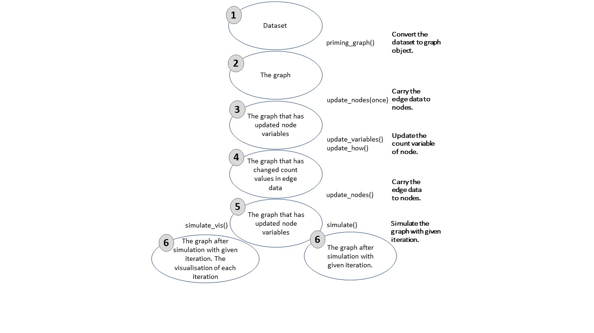

## Abstract

## Introduction

MicroRNAs (miRNAs) that are key regulator of gene expression through various post-transcriptional mechanisms are a family of short non-coding RNAs. Although repression mechanisms of miRNA are not fully understood, exact effect of miRNAs is regulation of direct target/targets negatively. Repressive activities of miRNAs vary depending on many factors that are significant to microRNA:target interactions. These factors include microRNA:target binding energy, binding location in target sequence, base pairing types between miRNA and target, abundance of miRNAs and targets [@grimson_microrna_2007]. Binding energies of miRNA:target complexes vary based on nucleotide context and determine folding stability of complex [@cao_predicting_2012]. It has been demonstrated that the binding energy between miRNA and target indicates stability or affinity of complex [@helwak_mapping_2013] and does not directly determine repressive activity of miRNA [@cao_predicting_2012]. Early studies have argued that 2-8 nt sequence, seed, located in miRNA 5’UTR bind to specific sequence located in 3’UTR of its target [@bartel_micrornas_2004; @lewis_conserved_2005]. In recent studies, it has been shown miRNAs can interact with targets via sequence that located in different region such as 5’UTR or CDS [@hausser_analysis_2013; @helwak_mapping_2013]moore_mirnatarget_2015. These studies also shown that binding location could indicate functionality of miRNA:target interaction or affect profile of target abundance. It has been shown that miRNAs exhibit repressive activity via, 6-8 nt long sequence that is prefectly complementary with targets, seed region at the 5’UTR of miRNAs [@bartel_micrornas:_2009; @grimson_microrna_2007]. On the other hand, some researchers have reported that seed sequence of miRNA can have mismatches or bulged/wobble nucleotides and locates in different region of miRNAs [@hafner_transcriptome-wide_2010; @helwak_mapping_2013]. In addition to all of these, abundance of miRNAs and targets and miRNA:target ratio in cells are determinant for efficiency of miRNA:target interaction [@arvey_target_2010; @bosson_endogenous_2014; @denzler_assessing_2014]. 
As it is possible for miRNAs to suppress multiple targets, an individual RNA molecule can also be targeted by various miRNAs. In that case, the targeted RNAs exhibit competitor behavior, that is hypothesized as competing endogenous RNAs (ceRNAs) [@ala_integrated_2013; @cesana_deciphering_2013], against their miRNAs. Briefly, Ala et al. have explained the ceRNA hypothesis as disturbtion of the other target when a steady-state system that included one miRNA and two target, was perturbed with expression changes at one of the targets [@ala_integrated_2013]. When interaction between miRNAs and their target were dealed in the cell, explanation and prediction of results of perturbation is difficult due to varieties of interactions. Various computational and experimental studies have applied to be understood for ceRNA:miRNA interactions. It has been observed that when abundance of one of the targets of miR-122 was increased, the other target expression also slightly increased as a result of decreasing repressive activity of miR-122 on them [@denzler_assessing_2014]. Bosson et al. have developed a mathematical model for changes on total target pool concentration after grouping to affinity of targets. They have demonstrated that miRNA activity correlated with affinity between miRNA and target [@bosson_endogenous_2014]. Cooperative efficiency of miRNAs as well as competitor behaviors of targets also were studied and it has been demonstrated crucial for regulations at expression of targets [@denzler_impact_2016]. MiRNA:target interactions have modelled as stoichiometric and catalytic mechanisms and Figliuzzi et al. have recommended to handling models in network structures [@figliuzzi_micrornas_2013]. The model that can explain miRNA target interaction through topological features has been applied at bipartite network by Nitzan et al. [@nitzan_interactions_2014]. Robinson and Henderson applied the model that handles miRNA:target direct and indirect interactions via common miRNA of gene and target of miRNA, at bipartite network. It has been demonstrated that whole miRNAs and targets in network can interacted through common miRNAs and genes [@robinson_modelling_2018]. Associated genes that are targets of the same miRNAs have been found with help of correlation of gene expression changes in recent study [@markus_list_sponge_2017]. List et al. have specified that their approach can be useful for ceRNA’s studies and published these approach as a package that can use with R programming.

## Methods

### miRNA:target ratio theoretical action in network based ceRNA model

We developed a novel network based approach that can use to simulation of gene regulation after any perturbation at miRNA:target interactions. If a perturbation or change induces on graph, whole interacted nodes vary because of changes in miRNA:target ratios. The system was assumed as steady state that miRNAs affect according to the ratio of the individual target to all targets (\autoref{fig1}a, expression values shown as integer for comprehensible sampling). When expression of gene 2 (G2) increased to two fold (\autoref{fig1}b), distribution of miRNA (M1) expression changes (\autoref{fig1}c). Consequently, expression of common target (G4) of miRNA1 and miRNA2 also varies. The change at expression of common target triggers to changes of proportional distribution of miRNA2 (\autoref{fig1}d). 

{#fig1}

The model was developed by making some assumptions. Transcription rates and degradation rates of miRNAs were assumed as stationary and equal. Targets also have stabil transcription and degradation rates, at the same time they are equal. The factors that could be affect the miRNA:target interaction are disregarded in this approach. It is considered that miRNAs degradates or inhibits them via any mechanisms after binding to target while the miRNAs were used reversibly. In initial conditions, gene expression amounts in system have been considered after repression activity of miRNAs. If a change occurs in the system, variation on miRNA proportional distribution are reflected as change of repression activity.

\begin{equation} 
    Eff_{gi}= C_m * C_{gi}/\sum_{1}^{i} C_g \tag{1}\label{eq:1}
\end{equation}

\begin{equation}
   R_{gi}= Eff_{i1}+ Eff_{i2} ... \tag{2}\label{eq:2}
\end{equation}

The efficiency of a miRNA on the individual target ($Eff_{gi}$) is calculated according to equation \eqref{eq:1}; $C_m$, miRNA expression in the group; $C_{gi}$, symbolize individual gene expression; $C_g$ gene expressions in the group (Groups are determined depending on miRNAs. Targets that are interacted with the same miRNA find in a group.). In this approach, because a gene can be found in different groups, the cooperative activity of microRNAs also can be calculated. Total repression activity of different miRNAs on the common target, $R$, is calculated based on equation \eqref{eq:2}; sum of efficiency of different miRNAs on the target. 

{#fig2}

### miRNA action in network based multifactorial ceRNA model

Interactions between miRNAs and their targets can be affected from different parameters. For this reason, we improved model with factors that can affect to miRNA activity. In our approach, the parameters are classified as binding and efficiency factors and all of these are evaluated in their groups. Binding factors determine interaction between miRNA and target. The efficiency factors decide functionality of binding. In the literature, binding free energy [@cao_predicting_2012 ; @helwak_mapping_2013] and seed type [@werfel_preferential_2017]in miRNA:target interactions are represented as binding affinity. Efficiency factors determine how many of microRNA:target complexes will result in inhibition. For example, binding region on the target shows whether the target can be inhibited (functionality)[@hausser_analysis_2013; @helwak_mapping_2013]. Both of binding and efficiency factors are evaluated in the groups and normalized according to equation \eqref{eq:3}; each factor is normalized based on maximum variables that found in their groups.

\begin{equation}
F`= F/F_{max} \tag{3}\label{eq:3}
\end{equation}

The normalized values of factors take into account to determine binding activity and miRNA efficiency on targets (\autoref{fig2}).  Binding affinities (activity, $Eff$) of miRNAs on each individual gene are calculated as shown in equation \eqref{eq:4}; $C_m$, miRNA expression in the group; $C_g$, Gene expression; $C_{gi}$, individual gene expression; gi, individual gene; g, whole genes in a group (\autoref{fig2}c). 

\begin{equation}
Eff_{gi}= C_m * E`_{gi}*STE`_{gi}*C_{gi}/(\sum_{0}^{i} E`_{gi}*STE`_{gi}*C_{gi}) \tag{4}\label{eq:4}
\end{equation}

\begin{equation}
Eff_{gi}= Eff_{gi}*RE`_{gi} \tag{5}\label{eq:5}
\end{equation}
                                            
After miRNA binds to its target, but might not repress to bound target. The functionality of bound miRNA on target depends on efficiency factors like region that is binding sequence of miRNA on its target. Exact repression efficiency of miRNA is calculated according to equation \eqref{eq:5} (\autoref{fig2}d); $RE’_{gi}$, normalized values of region efficiency coefficient between miRNA and gene. The cooperative repression activity of miRNAs to their common targets is figured out as shown in \autoref{fig2}e. 

{#fig3}

### Defined functions for ceRNA models

We defined the functions that can be used with R programming. Briefly, these functions process a given miRNA:gene dataset and convert to graph object. All values that are significant in miRNA:target interactions are stored in edge variables and processed with formulations that are given in previous sections. The functions and steps of approach are explained as following \autoref{fig3}:
1-2. Convertion of dataset: priming_graph function process the given dataset that includes competing elements in first variable and repressive element in second variable. If the affinity and/or degradation factors are specified in the function, factors are taken into account, are processed with defaults in vice versa. The formulations that are given in equations (i-v) are performed in this function. This step gives the graph object which contains efficiency values of miRNA:competing target pairs in steady-state in terms of amount. It is assumed that the initial target amounts in the dataset is observed after the reppressive activity of miRNAs in steady-state. 
2-3. Transition of variables in graph: In the previous step, the calculations are performed in the edge variables of the graph object. However, the graph object allows to use node variables, while the node features are handled to the graph. In this direction, update_nodes function carries the amount values to node variables This step must be applied with “once” option because it is primary process.
3-4. Trigger change in graph: The dataset are assumed as steady-state in previous step and the efficieny coefficients are calculated according to this acceptance. In the network that is found in steady-state conditions, the change is applied to the graph object for disturbtion of steady-state. To provide the disturbtion in the network the workflow offer two methods: update_variables and update_how. The fist, a new dataset that is contained competing and repressive element names and current values of these can be processed with update_variables. The second option, the amount of the given node name in update_how function can be changed according to “how” argument.
4-5. Updating current values of variables: After variables updating in edge varibles, these are carried to node variables. Current and previous values of variables are stored as node variables with update_variables function.
5-6. Simulation of competing behavior of targets: After the change in the steady- state conditions, the network elements try to gain steady-state again. This process progresses as repeating of regulations after the spreading the changes in the network. In this step, simulation of regulations according to given cycle count in simulate function is applied. After each simulation cycle, the miRNA repression values are re-calculated and the current values of competing elements are found and saved. The process is performed in the edge data and at the same time outputs of the calculations are carried from edge to node data.
The node elements in the dataset are handled as two type; repressives (miRNAs) and competings (targets). It is assumed in approach that while targets are degrading or inhibiting by miRNAs continuously, miRNAs reversibly used. If the trigger of the network is a miRNA, it maintains the current value of amount that provides by user. On the contrary, it tries to help this process to provide steady-state through the regulations on its amount, if a competing element is used as a trigger. The functions that are used in the approach are developed with R programming so as can be used with other packages. These are can be found in the github repository [ceRNAnetsim github page](https://github.com/selcenari/ceRNAnetsim) and improved with contributions of others.

## Results and Conclusions

We developed a model approach and workflow for competitive ceRNA regulation in this study. The basic mode of miRNA repression activity has been based on miRNA and target abundance in various researches[@arvey_target_2010; @denzler_assessing_2014]. For this reason, we performed first application as considering only abundance of miRNAs and targets (\autoref{fig1}). After the increasing in a gene expression value, expression values of other genes also changed slightly in comparison with alteration in perturbation started gene node. Different studies have shown that the other gene expression values also rise differently, if a gene abundance increases in ceRNA system [@lai_understanding_2016; @salmena_cerna_2011; @tay_multilayered_2014]. It was observed that primary neighborhoods of the trigger gene change with the same ratio, but cooperative efficiency of miRNAs on common target causes differently change in common target (\autoref{fig1}d). The common target in system displayed like a trigger for the other group and induced changes of expression values of genes on the other group. Therefore, effect of primary change of the gene (G2) on genes of the other group was observed slightly (\autoref{fig1}d). In addition, like shown by ceRNA hypothesis model of Ala et al., after the increasing of a gene expression (G2), the miRNA that is found in the same group (M1) tended to be more repressive on this target. This caused to decrease in increased expression value of primer triggering gene.
When the expression of a gene (G2) was increased to two fold, we observed that the expression changes were more evident. So, we considered that high miRNA:target ratio results in stronger miRNA repression activity. This results also are coherent with previous reports that were offered by Arvey et al. and Denzler et al.[@arvey_target_2010; @bosson_endogenous_2014; @denzler_assessing_2014]. When the simulation was ran in sample dataset that includes lower target abundance, the first response of primary neihgborhood of the same group was determined as similar with in system that have high target abudance. But regulations of ceRNAs were observed differences in the folowing steps of simulation. In overall state in the end of simulation, we established that all regulations more prominent when compared with low miRNA:target ratio datset. The model appeared the importance of mRNA:target ratio in regulation of competing RNAs.

{#fig4}

It has been reported in several studies that miRNA regulatory interactions also is affected different parameters. For example, Xu et. al have investigated the importance of seed pairing type between miRNAs and their targets and target site location by using proteomic dataset [@xu_characterization_2014]. They have proposed that the features of binding between miRNA and target can be critical efficiency of miRNA and can be used to find effective miRNA molecules. In addition, binding energy between miRNA and targets also could be determinant for miRNA efficiency. It has been reported by Breda et. al. that strength of miRNA:target interactions is depended on binding energy of complexes [@breda_quantifying_2015]. As similar to these, Bosson et al. have associated affinity and seed pairing of miRNA target pairs and suggested that number of canonical base pairing is correlated with affinity. For these reasons, we improved the model with optional interaction parameters that could be useful for understanding of miRNA repression activity. We explained the model in the same sample dataset with using different factors and simulated via the same change (\autoref{fig4}). When the factors were taken into account in the system, miRNA efficiencies varied as shown in \autoref{fig4}a. Although the miRNA target ratios in initial states were same in comparison with the sample dataset without factors, efficiency of binding and repression have changed. When expression of a gene (G2) increased, expression values of all genes also change differentially because of contribution of efficiency factors (\autoref{fig4} b,c,d).
In regulation of miRNA target sample system (\autoref{fig4}), miRNA (M1) repressive efficiency on the primary triggering gene (G2) is low in steady-state. So it has been observed that the regulatory activities of miRNA efficiencies on the targets are weak after the increase of miRNA target G2.  When we ran to model with two fold increasing expression value of common target (G4), the changes of other gene expressions were observed more prominent. Furthermore, folding of expression of target gene that has strong miRNA repression efficiency also resulted in evident perturbation.
The defined miRNA’ number is very low in comparison with defined protein coding genes’ number. So, this results in that the miRNA amounts in the system must be high or targeted RNAs’ amount must be low for effective miRNA activity. For these reasons, we tried to simulate a real dataset which contains thousands of genes and hundreds of miRNAs. Briefly, we have obtained the datasets and combined these via R programming. We have applied the our approach into integrated dataset using a selected gene. Firstly we observed the activities in the iterations and determined behaviours of the network after simulation. As expected, we have observed that the the huge dataset, compared to those containing a few genes and miRNAs, exhibited cumbersome behaviours and complexity to gain steady-state. We realized that a small change in a system with a large change actually brought many arrangements. This can be explained with the competing groups. Because the genes are targeted with many common miRNAs, and this results in that the common targets exhibits competing behaviours in different groups. On the other hand, the changes of gene expressions were very different. While the change in some of genes were highly evident, somes have changed slightly. So, we have compared two datasets: the tumor gene expression and simulation results. When we analysed comparison of two datasets, we observed that the results of simulation is not convenient with tumor tissue expression values. The simulation results were not expected to be concordant with tumor tissue expression values because of a single gene could not be responsible for gene regulation in all tissue. Besides, the all other factors such as up/down regulation of miRNAs or other genes were ignored. Of course, it would be more useful to test a dataset that includes gene expression values before and after the regulation of a gene. When we evaluated the suitability of approach, the approach allows different miRNA targets to be considered together and can work with different regulatory elements due to the network structure. 
The network based approaches have been developed in previous studies. Figliuzzi et al. have tried to explain the ceRNA crosstalk in a network-like minimal interaction structure with concentrations of ceRNA and miRNAs. They have pointed out that the larger miRNA number can cause to evident crosstalk between ceRNAs. It has been thought that miRNAs and their targets interactions depend on rates of transcription, degradation, binding and unbinding in the network based kinetic model which has been developed by Nitzan et al. Nitzan and collaborators have used the high throughput experimental dataset [@helwak_mapping_2013] for miRNA:target pair that occur high free energy and microarray dataset of a miR-92a depletion for expression values. They have been demonstrated that distant ceRNAs can interact with each other via indirect links, and the interactions change to depend on distance between ceRNAs, and topological features of network [@nitzan_interactions_2014]. 
In our approach, we have not taken into account transcription, degradation or binding rates of elements in network. Because, although it is known as the miRNAs are highly stable, the transcription and degradation rates of miRNAs change to depend on according to cellular conditions [@ruegger_microrna_2012]. According to our search, there is no dataset that was includes to degradation and transcription rates on specific cellular conditions for each miRNA. So, we preferred to accept that degradation and transcription rates of each miRNAs are equal to each other, instead of determining a constant value for all miRNAs in the system (The same applies to mRNA.). On the other hand other regulation parameters such as gene-gene interactions and transcription factors are ignored but the network structure can promote to integration of other regulation elements. In the future, with development in experimental techniques about features of miRNAs and their targets, more consistent and useful results can be obtained from our approach. Additionally, this can provide to contribution to prediction of abnormal regulations and pathways with the studies that will be developed.

## References
