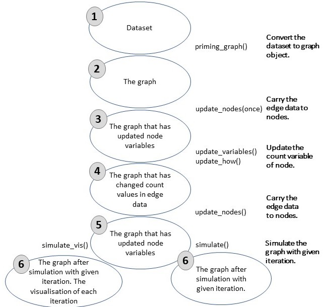

### Defined functions for ceRNA models and workflow of method
We defined the functions that can be used with R programming. Briefly, these functions process a given miRNA:gene dataset and convert to graph object. All values that are significant in miRNA:target interactions are stored in edge variables and processed with formulations that are given in previous section. The functions and steps of approach are explained as following (Figure 1) :


*Convertion of dataset*: priming_graph function processes the given dataset that includes competing elements in first variable and repressive element in second variable. If the affinity and/or degradation factors are specified in the function, factors are taken into account, are processed with defaults in vice versa. The formulations that are given in equations (1-5) are performed in this function. This step gives the graph object which contains efficiency values of miRNA:competing target pairs in steady-state in terms of amount. It is assumed that the initial target amounts in the dataset is observed after the reppressive activity of miRNAs in steady-state. 


{#fig1}


*Transition of variables in graph*: In the previous step, the calculations are performed in the edge variables of the graph object. However, the graph object allows to use node variables, while the node features are handled to the graph. In this direction, update_nodes function carries the amount values to node variables This step must be applied with “once” option because it is primary process.


*Trigger change in graph*: The dataset are assumed as steady-state in previous step and the efficieny coefficients are calculated according to this acceptance. In the network that is found in steady-state conditions, the change is applied to the graph object for disturbtion of steady-state. To provide the disturbtion in the network the workflow offer two methods: update_variables and update_how. The first, a new dataset that is contained competing and repressive element names and current values of these can be processed with update_variables. The second option, the amount of the given node name in update_how function can be changed according to “how” argument.


*Updating current values of variables*: After variables updating in edge varibles, these are carried to node variables. Current and previous values of variables are stored as node variables with update_variables function.


*Simulation of competing behavior of targets*: After the change in the steady-state conditions, the network elements try to gain steady-state again. This process progresses as repeating of regulations after the spreading the changes in the network. In this step, simulation of regulations according to given cycle count in simulate function is applied. After each simulation cycle, the miRNA repression values are re-calculated and the current values of competing elements are found and saved. The process is performed in the edge data and at the same time outputs of the calculations are carried from edge to node data.


The node elements in the dataset are handled as two type; repressives (miRNAs) and competings (targets). It is assumed in approach that while targets are degrading or inhibiting by miRNAs continuously, miRNAs reversibly used. If the trigger of the network is a miRNA, it maintains the current value of amount that provides by user. On the contrary, it tries to help this process to provide steady-state through the regulations on its amount, if a competing element is used as a trigger. The functions that are used in the approach are developed with R programming so as can be used with other packages. These are can be found in the github repository [ceRNAnetsim github page](https://github.com/selcenari/ceRNAnetsim) and improved with contributions of others.


```{r, message=FALSE, warning=FALSE}
library(ceRNAnetsim)
```

+ load *minsamp* data

```{r}
data("minsamp")

minsamp
```


|competing| miRNA | Competing_expression | miRNA_expression | seed_type | region | energy
|-----------|------------|----------|----------------|---------|-----------|----------|
| `Gene1`   | `Mir1` | 10000 | 1000 | 0.43 | 0.30 | -20 |
| `Gene2`   | `Mir1` | 10000 | 1000 | 0.43 | 0.01 | -15 |
| `Gene3`   | `Mir1` | 5000  | 1000 | 0.32 | 0.40 | -14 |
| `Gene4`   | `Mir1` | 10000 | 1000 | 0.23 | 0.50 | -10 |
| `Gene4`   | `Mir2` | 10000 | 2000 | 0.35 | 0.90 | -12 |
| `Gene5`   | `Mir2` | 5000  | 2000 | 0.05 | 0.40 | -11 |
| `Gene6`   | `Mir2` | 10000 | 2000 | 0.01 | 0.80 | -25 |


## *minsamp* dataset analysis in lack of interaction factors.

Firstly, we have analysed minimal data without interaction factors between miRNA:target.

- 1. We have evaluated graph in the steady state conditions as followings:

```{r, message=FALSE, warning=FALSE}
priming_graph(minsamp, competing_count = Competing_expression, miRNA_count = miRNA_expression)%>%
  update_nodes(once=TRUE)%>%
  vis_graph(Competing_color = "navajowhite3", mirna_color = "ivory4", title = "Minimal dataset in steady-state conditions")
```

- 2. We have obtained graph after change on Gene2 expression as followings:

```{r, message=FALSE, warning=FALSE}
priming_graph(minsamp, competing_count = Competing_expression, miRNA_count = miRNA_expression)%>%
  update_nodes(once=TRUE)%>%
  update_how("Gene2", 2)%>%
  update_nodes()%>%
  vis_graph(Competing_color = "navajowhite3", mirna_color = "ivory4", Upregulation = "red", title = "Gene2 Upregulation without interaction factors")
```


- 3. We have determined regulations after Gene2 Upregulation:

```{r, message=FALSE, warning=FALSE}

priming_graph(minsamp, competing_count = Competing_expression, miRNA_count = miRNA_expression)%>%
  update_nodes(once=TRUE)%>%
  update_how("Gene2", 2)%>%
  update_nodes()%>%
  simulate_vis(Competing_color = "navajowhite3", mirna_color = "ivory4", Upregulation = "red", Downregulation = "blue", title = "Regulations after Gene2 Upregulation", 2)

```
Note that the regulations are colored according to expression changes of present and a previous value. So, it can be observed that whole gene expressions increase in comparison of initial steady-state. The overall regulations of gene expressions are as followings:

```{r, message=FALSE, warning=FALSE}
priming_graph(minsamp, competing_count = Competing_expression, miRNA_count = miRNA_expression)%>%
  update_nodes(once=TRUE)%>%
  update_how("Gene2", 2)%>%
  update_nodes()%>%
  simulate(2)%>%
  activate(edges)%>%
  as_tibble()%>%
  select(Competing_name,comp_count_list,effect_list)%>%
  unnest()
```

## *minsamp* dataset analysis with interaction factors.

We have made the same analysis in present of interaction factors.

```{r, message=FALSE, warning=FALSE}
priming_graph(minsamp, competing_count = Competing_expression, miRNA_count = miRNA_expression, aff_factor = c(energy, seed_type), deg_factor = region)%>%
  update_nodes(once=TRUE)%>%
  vis_graph(Competing_color = "navajowhite3", mirna_color = "ivory4", title = "Minimal dataset in steady-state conditions")

```

```{r, message=FALSE, warning=FALSE}
priming_graph(minsamp, competing_count = Competing_expression, miRNA_count = miRNA_expression, aff_factor = c(energy, seed_type), deg_factor = region)%>%
  update_nodes(once=TRUE)%>%
  update_how("Gene2", 2)%>%
  update_nodes()%>%
  vis_graph(Competing_color = "navajowhite3", mirna_color = "ivory4", Upregulation = "red", title = "Gene2 Upregulation without interaction factors")
```

```{r, message=FALSE, warning=FALSE}
priming_graph(minsamp, competing_count = Competing_expression, miRNA_count = miRNA_expression, aff_factor = c(energy, seed_type), deg_factor = region)%>%
  update_nodes(once=TRUE)%>%
  update_how("Gene2", 2)%>%
  update_nodes()%>%
  simulate_vis(Competing_color = "navajowhite3", mirna_color = "ivory4", Upregulation = "red", title = "Gene2 Upregulation without interaction factors",2)
```

When the graphs which were resulted from analyses were examined, it was observed that behaviours were same. But, when the results were analysed in terms of expression values, the regulation differences can be observed.

```{r, message=FALSE, warning=FALSE}
priming_graph(minsamp, competing_count = Competing_expression, miRNA_count = miRNA_expression, aff_factor = c(energy, seed_type), deg_factor = region)%>%
  update_nodes(once=TRUE)%>%
  update_how("Gene2", 2)%>%
  update_nodes()%>%
  simulate(3)%>%
  activate(edges)%>%
  as_tibble()%>%
  select(Competing_name,comp_count_list,effect_list)%>%
  unnest()
```

## Common target perturbation in *minsamp* dataset.

There are hundreds of defined miRNAs for human, so this results in presence of common targets of miRNAs in cells. Therefore, we have analysed perturbation efficiency of common target in *minsamp* dataset.

```{r, message=FALSE, warning=FALSE}
priming_graph(minsamp, competing_count = Competing_expression, miRNA_count = miRNA_expression, aff_factor = c(energy, seed_type), deg_factor = region)%>%
  update_nodes(once=TRUE)%>%
  update_how("Gene4", 2)%>%
  update_nodes()%>%
  simulate_vis(Competing_color = "navajowhite3", mirna_color = "ivory4", Upregulation = "red", title = "Gene2 Upregulation without interaction factors",2)
```

The common target perturbation  (increasing to two fold at Gene4 expression in presence of interaction factors) resulted in more prominent efficiency at the same conditions (shown in following).

```{r, message=FALSE, warning=FALSE}
priming_graph(minsamp, competing_count = Competing_expression, miRNA_count = miRNA_expression, aff_factor = c(energy, seed_type), deg_factor = region)%>%
  update_nodes(once=TRUE)%>%
  update_how("Gene4", 2)%>%
  update_nodes()%>%
  simulate(3)%>%
  activate(edges)%>%
  as_tibble()%>%
  select(Competing_name,comp_count_list,effect_list)%>%
  unnest()
```

## Determination of perturbation efficiencies efficiencies of elements in system.


```{r, message=FALSE, warning=FALSE}

priming_graph(minsamp, competing_count = Competing_expression, miRNA_count = miRNA_expression, aff_factor = c(energy, seed_type), deg_factor = region)-> sample_graph

find_node_perturbation(sample_graph, how = 2, cycle = 3, limit = 0.1)

```

